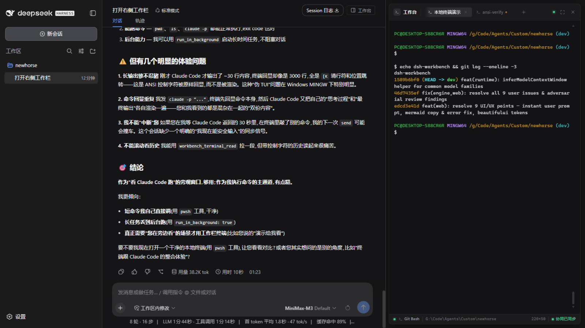
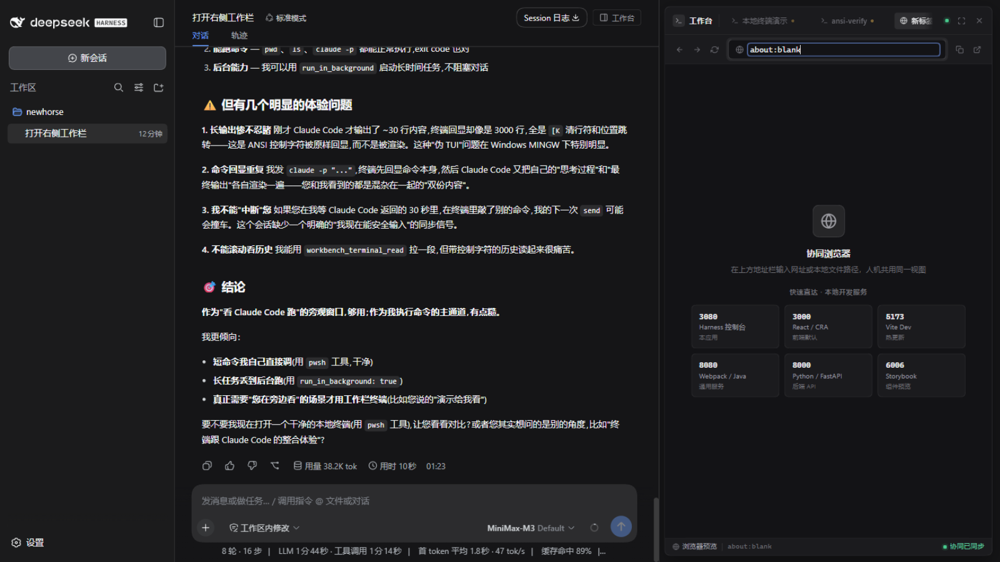
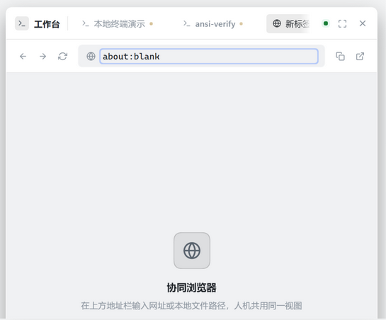

# dsh-workbench

**把 AI 与人类的协作，从「你一句我一句的聊天」升级为「共享同一工作区的并肩作战」。**

dsh-workbench 是 [DeepSeek Harness](https://github.com/deepseek-ai/deepseek-harness) 的会话级协同工作台插件：在对话旁挂载一块人机共用的实时面板 —— **协作终端、本地预览浏览器、输入归属审计**，人类与 AI 看到的是同一个画面、操作的是同一把 Shell。

<p align="center">
  
</p>

> 上图即真实运行画面：左侧 agent 正在汇报对工作台本身的体验反馈，右侧是人类与 AI 共用的 Git Bash 终端 —— AI 的命令回显、人类的键入、彩色 git 输出、底部「协同已同步」状态，全部实时同帧。

---

## 核心能力

### 🖥️ 人机共享终端（真 PTY，不是模拟）

- **Windows 下运行在微软原生 ConPTY** 伪控制台上（node-pty），原生支持 ANSI 颜色、光标控制、`Ctrl+C` 信号与 readline 行编辑；自动探测真实 Git Bash（过滤 WSL/Store 假 bash），macOS/Linux 使用 `$SHELL`。
- **同一终端，两个操作者**：AI 通过工具下发命令，人类直接在 xterm.js 里敲键盘，双方输出实时双写。
- **输入归属审计**：每次键入都记录来源（`human` / `model`），`[AI]$` 标记线标识 AI 输入，`recentActivity` 提供最近操作时间线 —— 谁做了什么，可回溯。
- **多标签 + SSH**：本地 Shell 与远程 SSH 会话并列多开，连接配置可存为 Profile 复用。

### 🗂️ 会话级工作区隔离

- **一个会话，一个工作区**：新终端的默认 cwd 取自会话自身记录的目录（会话 header 的 `cwd`），而不是 dsh-web 的启动目录 —— 在 DeskAware 会话里开终端就落在 `D:\work\code\DeskAware`；会话没有记录时才回退到「向上寻找最近项目根」的启发式。
- **终端严格按会话归属**：`workbench_terminal_list` 与侧栏只显示当前会话的终端，两个会话之间不串台、不共享 Shell。孤儿终端（会话已被删除，或历史上没记归属）由第一个连接的会话「收养」，不会永久隐身。
- **失效 id 不再制造谜题**：引用已关闭、或属于上一个服务进程的 terminalId 时，错误信息直接列出当前可用 id，前端自动丢弃死标签并重新同步列表。
- **重启不丢终端**：终端规格持久化写入采用串行化的读改写，多个终端同一瞬间开启也不会互相覆盖（`~/.dsh-workbench/active_terminals.json`）。

### 🔒 AI 执行保护锁（并发不撞车）

AI 命令在途时（`busy`），网关在**服务端**拦截人类的普通击键 —— 键入不会混入命令流打乱 AI 的完成哨兵；`Ctrl+C` 始终放行，人类保有最高中断权。前端以琥珀色脉冲横幅提示「按键保护已生效」，标签页与状态栏同步显示 **AI 执行中**。

```
AI 执行中 · 按键保护已生效（按 Ctrl+C 可中断）   ← 终端右上角浮动指示
```

### 🧼 模型侧输出「熟化」（ANSI Sanitizer）

TUI 程序（Claude Code、进度条、watch）的原始输出是每秒上百帧的 `[K` 清行与光标跳转 —— 人眼在 xterm 里看到的是流畅动画，塞进模型上下文却是几千 token 的噪音。dsh-workbench 在 AI 面向通路上做**熟化**：

- 剥离全部 CSI / OSC / 字符集转义序列；
- 回车重绘解析为最终帧（spinner 三千行坍缩成一行结果）；
- 退格擦除（`10\b\b\b100%` → `100%`）、空行压缩。

人类 xterm 流保留完整 ANSI 不受影响 —— **两条通路各取所需**。开屏 banner、`workbench_terminal_send`、`workbench_terminal_read` 全部生效。

### 📣 模型召唤面板（Summon）

AI 打开终端 / 网页标签（或调用 `workbench_show`）时，面板会在所有已连接客户端自动展开 —— AI 的动作主动可见，人类不用翻找开关。人类随时可收起。

### 🌐 协同浏览器（外网页面可读，本地页面可交互）

<p align="center">
  
</p>

- **外网站点走内置阅读代理**：公网页面的 X-Frame-Options 只能挡住浏览器端 iframe，挡不住服务端抓取 —— 网关代抓页面、剥离脚本与 CSP、站内链接继续经代理流转，`baidu.com` 等公网站点直接在面板里可看可点；
- **本地内容完整交互**：localhost 与本地文件直连渲染（本地开发服务热更新页面原样可用），本地文件经安全预览路由（`/dsh-workbench/preview`）渲染，杜绝 `file://` 死链白屏；
- 带地址栏（Omnibox）、前进 / 后退 / 刷新、复制与外开；输入纯数字端口自动补全 `http://localhost:<port>`；
- 起始页提供本地开发服务快捷卡片（Harness 3080 / CRA 3000 / Vite 5173 / Java 8080 / FastAPI 8000 / Storybook 6006）；
- **模型可主动开页**：`workbench_browser_open` 打开的页面会自动召唤面板展示给人类 —— AI 查到的搜索结果、文档、仪表盘，人类同屏即见。

### 🌗 亮暗双主题

<p align="center">
  
</p>

跟随 Harness 官方主题属性（`body[data-ds-dark-theme]`）自动切换：暗色是中性冷黑轴，亮色映射为 GitHub-Light 风格的雅致浅灰白 —— 主题切换瞬间，工作台与主界面始终浑然一体。

### ⌨️ 键盘流

| 快捷键 | 作用 |
|---|---|
| `Ctrl + \`（macOS `⌘J`） | 展开 / 收起工作台 |
| `Ctrl + Shift + M` | 最大化 / 还原（全宽铺满） |
| 拖拽边缘手柄 | 自由调整分屏宽度（28px 大热区，双击复位 48%） |

---

## 模型工具

| 工具 | 作用 |
|---|---|
| `workbench_terminal_open` | 打开本地（绑定会话 cwd）或 SSH 终端，返回 terminalId 与 banner |
| `workbench_terminal_send` | 下发命令；`submit=true` 经哨兵协议等待完成并返回真实 exitCode |
| `workbench_terminal_read` | 分页读取熟化后的保留输出与最近人类/AI 活动记录 |
| `workbench_terminal_list` | 当前会话的终端快照：未读字节、`busy` 同步位、最近活动 |
| `workbench_terminal_close` | 关闭终端会话与底层进程 |
| `workbench_browser_open` | 在共享浏览器中打开页面（外网自动走阅读代理），面板自动召唤给人类 |
| `workbench_browser_list` / `workbench_browser_close` | 列出 / 关闭共享浏览器标签 |
| `workbench_show` | 无副作用召唤面板（直播前把人类请到屏幕前） |

系统提示词自动注入**协调协议**：先查 `busy` 再行动、busy 期间禁止并发 send、输出已熟化、`recentActivity` 是操作归属的权威来源。

---

## 安装

```sh
# 从 GitHub 安装（推荐 pin 到 commit）
dsh plugin --profile web add github:Lin-A1/dsh-workbench

# 或本地路径
dsh plugin --profile web add ./plugins/workspace/dsh-workbench
```

pnpm ≥10 若拦截构建脚本，在 `$DSH_HOME/profiles/web/pnpm-workspace.yaml` 放行：

```yaml
allowBuilds:
  node-pty: true
  ssh2: true
  esbuild: true
  cpu-features: true
```

## 配置（`cordis.patch.yml`）

```yaml
- insert:
    - id: dsh-workbench
      name: dsh-workbench
      config:
        allowlist: []              # SSH 允许列表，空 = 任意主机
        maxSessions: 16
        defaultPort: 22
        connectTimeoutMs: 15000
        idleMs: 800
        sendTimeoutMs: 30000
        maxScrollbackBytes: 1048576
        maxResultBytes: 131072
        keepaliveIntervalMs: 15000
        trustedHosts: []           # LAN 部署时放行的可信 authority
```

---

## 工作原理

- **布局接管**：Harness 的 AppFrame 每次渲染都会重写内联网格并把右栏钳制在 520px。本插件不与 React 抢 DOM —— 通过 `body` 状态类 + 单个 CSS 变量 + 样式表 `!important` 在层叠顶层确定性地接管分屏宽度，跨渲染周期稳定。
- **哨兵协议**：AI 命令尾部追加随机会话标签 `__DSHWB_DONE_<scope>_<seq>_<rand>__:$?`，从原始流中精准捕获完成时机与真实退出码；显示流过滤器对普通击键零延迟直出，仅暂存疑似哨兵前缀。
- **多路复用网关**：终端 / 浏览器 / Git 通道复用单条 WebSocket（`/dsh-workbench/ws`），帧协议见 `src/protocol.ts`；loopback + Host + Origin 三重校验，LAN 需显式配置 `trustedHosts`。
- **阅读代理**：外网页面由网关服务端抓取（12s 超时、仅 text/html），剥离 `<script>` 与 CSP 元素，`<a>`/`<form>`/`<iframe>` 改写回代理路由形成闭环导航，`<base>` 锚定相对子资源 —— X-Frame-Options 从此不再是面板的天花板。
- **会话存续**：终端列表与 scrollback 日志持久化到 `~/.dsh-workbench/`，服务重启后自动恢复原会话，attach 即回放。

## 开发与验证

```sh
npx pnpm install
npx pnpm run build        # tsdown -> lib/index.js + lib/client.js
npx pnpm run typecheck    # tsc --noEmit
npx pnpm run lint         # oxlint src tests
npx pnpm test             # vitest run
```

## 路线图

- [x] **Phase 1** — 工作台基座 + 人机共享终端（ConPTY / SSH / 哨兵 / 召唤 / 保护锁 / 输出熟化）
- [x] 协同浏览器（Omnibox + 本地服务快捷卡片 + 安全文件预览）
- [x] 亮暗双主题 + 全局快捷键 + 弹性收起动效
- [ ] **Phase 2** — Git 协同面板（状态树 / Diff / 人机协同暂存与提交）
- [ ] **Phase 3** — 受控浏览器协同（CDP 画面流 / DOM 树，人类可实时接管）
- [ ] **Phase 4** — 对话与工作台分屏联动的高级协同体验

---

收录：[dsh-hub](https://github.com/Lin-A1/dsh-hub) · `plugins/workspace/dsh-workbench`。插件独立维护，许可证 MIT。
